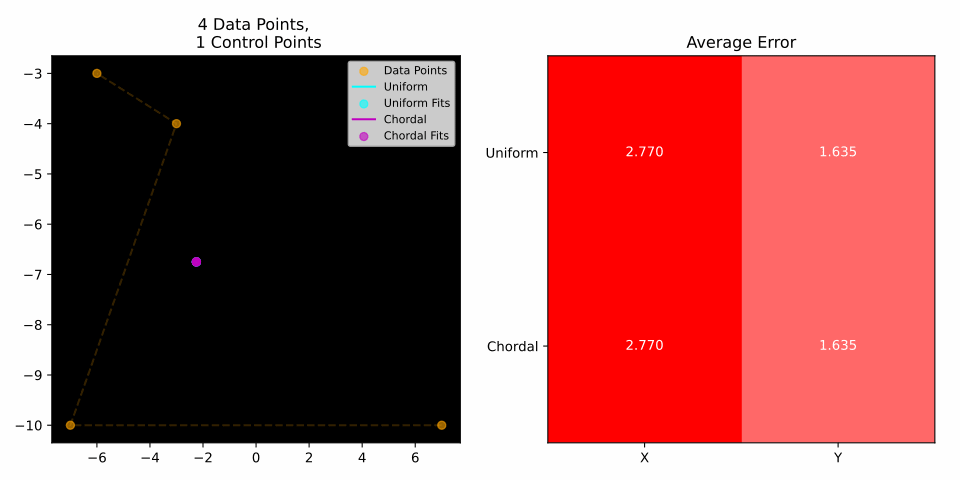
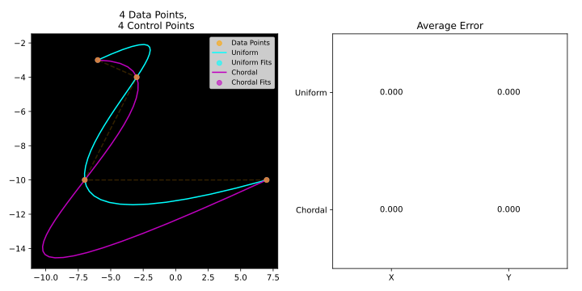
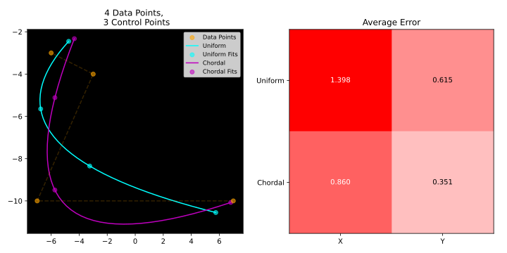
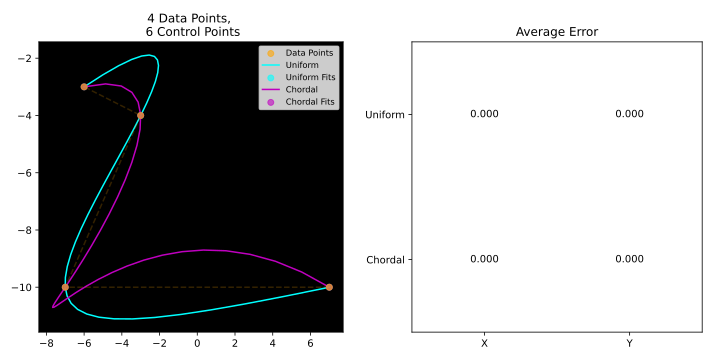

# Bézier Curve Fitting

Suppose you have $n$ data points `(x, y)` and you want to find the Bézier curve of degree $d$ that best fits them.

A Bézier curve is an interpolation of given *control points* — a linear combination whose weights always sum to one.

This program finds such *control points*.


*Example for random Data Points*

---

## Table of Contents

1. [Data Points](#data-points)
2. [Auto Parameterization](#auto-parameterization)
   - [Uniform Parameterization](#uniform-parameterization-μ--0)
   - [Chordal Parameterization](#chordal-parameterization-μ--1)
3. [Control Points](#control-points)
4. [Bernstein Basis Polynomials](#bernstein-basis-polynomials)
5. [Finding Control Points](#finding-control-points-fitting-a-bézier-curve)
   - [Setting Up the Linear System](#setting-up-the-linear-system)
   - [Solving the Linear System](#solving-the-linear-system)
   - [Least Squares Method (LSM)](#least-squares-method-lsm)
6. [Bézier Interpolation (de Casteljau)](#bézier-interpolation-de-casteljau-algorithm)
7. [Residual Error](#residual-error)
8. [Plotting](#plotting)
9. [Running the Program](#running-the-program)

---

## Data Points

We have a sequence of $n$ points in 2D space:

$$\vec{d} = \left[ D_0,\ D_1,\ \dots,\ D_{n-1} \right], \quad D_i = (x_i,\ y_i)$$

These are **randomly generated** within a bounding box. The goal is to find which control points define a Bézier curve that passes through — or as close as possible to — all of them.

---

## Auto Parameterization

A Bézier curve is not a function of space — it is a function of an abstract parameter $t \in [0, 1]$.

Each coordinate axis can be expressed as a polynomial in $t$:

$$B(t) = \bigl(X(t),\ Y(t)\bigr)$$

To fit a curve to our data points, we must assign a parameter value $t_i$ to each $D_i$. This is called **parameterization**, and the choice of strategy significantly affects the quality of the fit.

The general formula is:

$$t_0 = 0$$

$$t_{i} = t_{i-1} + \|D_{i} - D_{i-1}\|^{\mu}, \quad \mu \in [0, 1]$$

After computing all increments, the values are **normalized** by dividing by $t_{n-1}$, so that $t_0 = 0$ and $t_{n-1} = 1$.

The exponent $\mu$ controls how strongly chord length influences the parameter spacing:

### Uniform Parameterization ($\mu = 0$)

When $\mu = 0$, the distance term $\|D_{i} - D_{i-1}\|^0 = 1$ regardless of actual spacing, giving:

$$t_i = \frac{i}{n - 1}$$

Parameters are **evenly spaced**. This is simple but ignores how far apart the data points actually are. It can cause bunching or stretching of the curve where data points are unevenly distributed.

### Chordal Parameterization ($\mu = 1$)

When $\mu = 1$, the increment equals the Euclidean distance between consecutive points:

$$t_i = t_{i-1} + \|D_{i} - D_{i-1}\|$$

(followed by normalization). The parameter spacing **reflects the actual chord lengths**, so the curve is paced proportionally to the geometry of the data. This generally produces a more natural fit.

> **In code** (`parameterize.py`): the `micro` argument controls $\mu$. Passing `0` gives uniform, passing `1` gives chordal.

---

## Control Points

Control points $C_0, C_1, \dots, C_{d-1}$ are the "handles" that define the shape of a Bézier curve. The curve does **not** necessarily pass through them — it is pulled *towards* them.

The only exceptions are the **first** ($C_0$) and **last** ($C_{d-1}$) control points, which the curve always interpolates exactly. This can be trivially deduced from the mathematical definition of the curve.

A degree $d-1$ Bézier curve has exactly $d$ control points. The relationship between $d$ and $n$ determines whether the fit can be exact:

| Condition | Meaning                                                                                              |
|-----------|------------------------------------------------------------------------------------------------------|
| $n = d$   | Determined — the curve passes through every data point                                               |
| $n > d$   | Over-determined — best approximate fit via Least Squares                                             |
| $n < d$   | Under-determined — the curve passes through every data point with possible redundant loops and turns |

---

## Bernstein Basis Polynomials

The Bernstein basis polynomials are the **weights** used to blend control points into the curve. For degree $d-1$ and index $j$:

$$b_{j,\,d-1}(t) = \binom{d-1}{j} \cdot t^{j} \cdot (1-t)^{d-1-j}, \quad j = 0, 1, \dots, d-1$$

They have two key properties:

**Non-negativity:** $b_{j,d-1}(t) \geq 0$ for all $t \in [0,1]$

**Partition of unity:** $\displaystyle\sum_{j=0}^{d-1} b_{j,\,d-1}(t) = 1$ for all $t$

This guarantees that the curve lies within the **convex hull** of its control points — a very useful geometric property.

> **In code** (`bernstein.py`): `bernstein_basis(n, j, t)` computes $b_{j,n}(t)$, and `get_coefficients_matrix` builds the full $A$ matrix by evaluating all basis polynomials at each parameter value.

---

## Finding Control Points (Fitting a Bézier Curve)

We want to find control points $C_0, \dots, C_{d-1}$ such that 
the curve passes through (or near) each data point $D_i$ at its assigned parameter $t_i$:

$$B(t_i) = D_i \quad \text{for each } i = 0, 1, \dots, n-1$$

Expanding the Bézier equation:

$$B(t_i) = \sum_{j=0}^{d-1} b_{j,\,d-1}(t_i) \cdot C_j = D_i$$

This gives one equation per data point. Together, they form a linear system.

### Setting Up the Linear System

$$A \cdot \vec{c} = \vec{d}$$

where:

- $A$ is the $(n \times d)$ **coefficients matrix**, with entries:

$$a_{ij} = b_{j,\,d-1}(t_i)$$

Each row $i$ corresponds to a data point; each column $j$ to a control point.

$$
A = \begin{bmatrix}
b_{0,d-1}(t_0) & b_{1,d-1}(t_0) & \cdots & b_{d-1,d-1}(t_0) \\
b_{0,d-1}(t_1) & b_{1,d-1}(t_1) & \cdots & b_{d-1,d-1}(t_1) \\
\vdots & \vdots & \ddots & \vdots \\
b_{0,d-1}(t_{n-1}) & b_{1,d-1}(t_{n-1}) & \cdots & b_{d-1,d-1}(t_{n-1})
\end{bmatrix}
$$

- $\vec{c} = [C_0,\ C_1,\ \dots,\ C_{d-1}]^\top$ is the vector of **control points** to find.

- $\vec{d} = [D_0,\ D_1,\ \dots,\ D_{n-1}]^\top$ is the vector of **data points**.

Since $(x, y)$ are independent, the system is solved **separately for each axis** — but in practice the matrix $A$ is the same for both, so the solve handles both columns of $\vec{d}$ simultaneously.

### Solving the Linear System

#### **Case $d = n$:**
The matrix $A$ is square $(n \times n)$ and — assuming distinct parameter values — invertible. The system has a **unique exact solution**:

$$\vec{c} = A^{-1} \vec{d}$$

The curve passes exactly through every data point.


<hr>

#### **Case $n > d$:**
The matrix $A$ is vertical rectangular and the system is OverDetermined. We instead solve the **normal equations** to minimize the residual in the least-squares sense:

$$A^\top A \cdot \vec{c} = A^\top \vec{d}$$

$$\vec{c} = (A^\top A)^{-1} A^\top \vec{d}$$

The resulting curve is the one that **optimally** approximates (with degree $d$) the given set of data points. 


<hr>

#### **Case $n < d$:**
The matrix $A$ is horizontal rectangular and the system is UnderDetermined. We solve computing the **pseudo-inverse** by **SVD decomposition**:

$$A = U \Sigma V^{T}$$
$$A^{\dagger} = V \Sigma^{-1} U^{T}$$
$$\vec{c} = A^{\dagger} \vec{d}$$

The curve passes exactly through every data point. 
Exceeding Control Points tends get redundant values such that they do not contribute in interpolation.
Too many redundant Control Points can accumulate floating point error leading to unnecessary turns and loops.


<hr>

> **In code** 
> (`bezier.py`): `fit()` calls `np.linalg.solve(A, d)` for the Determined case,
> `np.linalg.solve(A.T @ A, A.T @ d)` for the OverDetermined case,
> `np.linalg.pinv(A) @ data_points` for the UnderDetermined case.

### Least Squares Method (LSM)

When there are more data points than control points ($d < n$), the curve cannot pass through all of them exactly. The Least Squares Method finds the control points that **minimize the sum of squared distances** between the curve and the data points:

$$\min_{\vec{c}} \| A \vec{c} - \vec{d} \|^2$$

Taking the gradient and setting it to zero yields the **normal equations** above. The solution is the **orthogonal projection** of $\vec{d}$ onto the column space of $A$.

Geometrically: among all Bézier curves of degree $d$, we pick the one that is *closest* to the data in the least-squares sense.

---

## Bézier Interpolation (de Casteljau Algorithm)

Once the control points are known, we evaluate the curve at any $t$ using the **de Casteljau algorithm** — a numerically stable recursive scheme:

$$B_{[P_i]}(t) = P_i \quad \text{(base case)}$$

$$B_{[P_i, \dots, P_k]}(t) = (1-t) \cdot B_{[P_i, \dots, P_{k-1}]}(t) + t \cdot B_{[P_{i+1}, \dots, P_k]}(t)$$

At each level, each pair of adjacent points is **linearly interpolated** by $t$. After $d-1$ levels, a single point remains — the curve point $B(t)$.

For example, with 3 control points $P_0, P_1, P_2$:

$$Q_0 = (1-t)\,P_0 + t\,P_1, \quad Q_1 = (1-t)\,P_1 + t\,P_2$$

$$B(t) = (1-t)\,Q_0 + t\,Q_1$$

This is equivalent to the explicit Bernstein formula but avoids numerical instability for high degrees.

> **In code** (`bezier.py`): `interpolate(cps, t)` implements this recursion directly. It is called over a dense `linspace` of $t$ values to draw the smooth curve.

---

## Residual Error

After fitting, we measure how well the curve reproduces the data points. The residual error for each axis is:

$$e = \frac{\| A\,\vec{c} - \vec{d} \|}{n}$$

This is the **mean Euclidean residual** — the average distance between where the curve says a data point should be and where it actually is. A value of $0$ means a perfect fit.

The program computes this separately for $X$ and $Y$, and for both parameterization methods, displaying all four values in a $2 \times 2$ heatmap:

|  | $X$ error | $Y$ error |
|---|---|---|
| **Uniform** | $e_{u,x}$ | $e_{u,y}$ |
| **Chordal** | $e_{c,x}$ | $e_{c,y}$ |

Darker red cells indicate larger error. Comparing rows reveals which parameterization better captures the data's geometry.

> **In code** (`bezier.py`): the error is returned by `fit()` as `np.linalg.norm((A @ control_points) - data_points, axis=0) / n`.

---

## Plotting

The visualizer (`visualizer.py`) produces a two-panel figure:

**Left panel — Curve Plot:**
- Orange dots and dashed line: the original random data points in order.
- Cyan curve and dots: the Bézier curve fitted with **uniform** parameterization, and where it evaluates at each $t_i$.
- Magenta curve and dots: the Bézier curve fitted with **chordal** parameterization.

This lets you visually compare how well each method hugs the data.

**Right panel — Error Heatmap:**
- A $2 \times 2$ image where rows are parameterization strategies and columns are coordinate axes.
- Cell values are the mean residual errors.
- White = low error, red = high error.

The figure is saved to `output/Experiment.svg`.

---

## Running the Program

**Requirements:**
```
numpy
matplotlib
```

Install with:
```bash
pip install numpy matplotlib
```

**Run:**
```bash
python main.py
```

**Key parameters** (edit in `main.py`):

| Variable | Meaning                                     |
|----------|---------------------------------------------|
| `n`      | Number of random data points                |
| `d`      | Number of control points (curve degree + 1) |
| `rb`     | Coordinate range for random points          |

Set `d = n` for an exact interpolating fit, or `d < n` for a smoothed least-squares approximation.

The output figure is saved to `output/Experiment.svg` and also displayed.