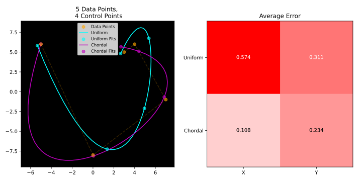

'> Aproximação de uma curva de Bézier paramétrica de grau arbitrário (n) a um conjunto de
pontos aleatórios. Coloque um slide-button (variável p) para controlar o número de pontos
(que será igual a p+1, p>3) a serem aproximados pela curva de Bézier, e outro slide-button
para controlar o grau da curva. Os pontos a serem aproximados devem ter suas coordenadas
geradas por um gerador de números aleatórios. Com relação aos parâmetros
correspondentes aos pontos gerados, teremos dois casos para compararmos:
(a). Parametrização uniforme: O valor de parâmetro da curva de Bézier correspondente ao i-
ésimo ponto a ser aproximado é dado por i/p (parametrização uniforme), sendo que o
primeiro ponto terá valor 0 e o último ponto (p+1-ésimo) terá valor de parâmetro 1.
(b). Parametrização pelo comprimento dos segmentos: Após a geração aleatória dos pontos,
calculam-se as distâncias entre os pontos consecutivos, colocando-se numa lista. Em seguida,
somam-se as distâncias para formar o total. E então cria-se uma lista com as distâncias
normalizadas por esse total (vão ficar entre 0 e 1). Encontre pelo MMQ as coordenadas dos
pontos de controle (um MMQ para as abscissas e um MMQ para as ordenadas), desenhe a
curva e exiba o erro residual total para cada tipo de parametrização, sendo este a soma dos
erros nas abscissas e nas ordenadas (e =||A x - b|| para cada dimensão, onde x é a solução aproximada encontrada). Projeto em trio.
# Bezier Fitting

Suppose you have $n$ data points `(x, y)` and you want to find the Bezier Curve of degree $d$ that better fits them. (If $d \ge n$, its a perfect fit)

A bezier curve is a interpolation of given *control points*. (A Linear Combination with summing-one weights).

This program finds such *control points*.

# Data points

We want to find the curve that contains the data points.

The mission then is to find wich control points define such curve.

data points are randomly generated

## Auto Parameterization

The parameter $t$ is an abstract value assigned to each data point that controls how the curve is paced.

Although the resulting curve is clearly not a polynomial, each coordinate axis of it can be expressed as a polynomial function of $t$:

$$B(t) = (X(t), Y(t))$$

The formula for assigning a $t_i$ for each $D_i$ in a vector of data points $\vec{d} = \left[ D_i = (x_i, y_i) \right] $ is:

$$t_0 = 0$$

$$t_{i+1} = t_i + d_i$$

$$d_{i}=\|D_{i+1}-D_{i}\|{}^{\mu },\quad \mu \in [0,1]$$

The exponent $\mu$ controls the relationship between chord length and parameter spacing.

**If** $\mu = 0$, parameterization gets *uniform*.

**If** $\mu = 1$, parameterization gets *chordal*.

# Control Points

Control points define the curve shape, although the curve does not necessairly contains them. (Except for the first and last one).

The bezier curve is expressed as a interpolation (linear combination) of control points.

# Finding Control Points (Fitting a Bezier Curve)

The control points are found by creating a $ (n \times d) $ linear system, where each equation set the condition that the bezier curve contains a data point.

$$
B(t_i) = D_i
$$
for each Data Point $D_i$ and its respective Parameter $t_i$ among $n$.

Where:

$$
B(t) = \sum_{j=0}^{n} b_{j,d}(t) \cdot C_j
$$

is the Bezier Curve equation,

$$
C_j
$$

is the $j$-th control point we want find,

$$
b_{j,d}(t) = \binom{d}{j} \cdot t^j \cdot (1-t)^{d-j}
$$

Is the bernstein basis polinomial: The interpolation weight for each control point in the Bezier Equation.

### Setting up the linear system

$$
A \cdot \vec{c} = \vec{d}
$$

where

$A$ is the coefficients matrix such that $a_{ij}= b_{j,d-1}(t_i)$ for each row $i$ and column $j$.

$\vec{c}$ is the vector containing the control points $C_i$.

$\vec{d}$ is the vector containg the data points $D_i$.

### SOlving the linear system

**If** $d < n$, the Bezier Curve can't fit exactly all points (There is more Data Points than Control Points, so the Curve Degree is not enough).

The coefficients matrix $(n \times d)$ is retangular
and the system is solved using the Least Squares Method.

**If** $d = n$, the Bezier Curve fits exactly all points.

The coefficients matrix $(n \times d)$ is square and invertible.

**If** $d > n$, the Bezier Curve has more degrees (Control Points) than needed to fit the Data Points.

The coefficients matrix $(n \times d)$ is retangular
and the system is solved using the Least Squares Method.

### LSM

# Bezier interpolation

The control points can be recursivelly interpolated by:

$B_{P_0}(t) = P_0$

$B(t) = B_{P_0...P_n}(t) = (1-t) \cdot B_{P_0...P_{n-1}}(t) + (t) \cdot B_{P_1...P_n}(t)$

# Plotting